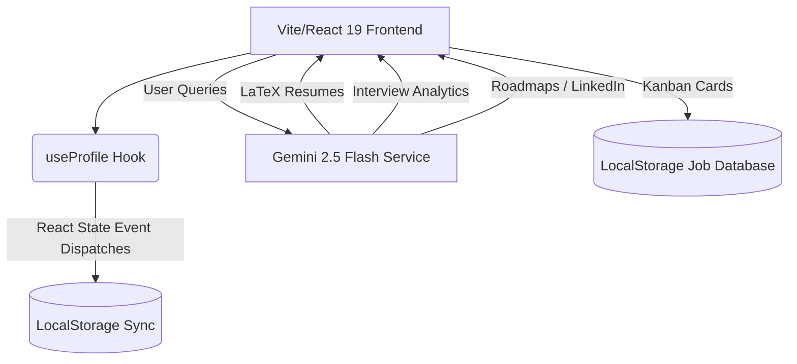

# CareerFlow AI 🚀
### *Premium, Open-Source Career Intelligence Dashboard & AI Resume Architect*

CareerFlow AI is a high-fidelity, open-source web application designed to supercharge your career transition. Powered by Google's state-of-the-art **Gemini 2.5 Flash** models, the platform acts as an automated, intelligent career coach—tailoring LaTeX resumes, evaluating interviews, optimizing social presence, mapping learning plans, and tracking applications within a stunning dark-mode glassmorphic dashboard.


---

##  Core Features

### 1. Centralized Profile Editor
Say goodbye to hardcoded profiles. CareerFlow AI decouples user data into a highly reactive local storage layer. Custom tabs enable full CRUD control over:
*   **Basic Info & Professional Summary**
*   **Academic History & Honors**
*   **Skills Segmentation** (AI/GenAI, Data Engineering, Languages, Web/Cloud, Hardware, Soft Skills)
*   **Work Experience & Personal Projects** (with dynamic add/remove achieves)
*   **Awards & Certifications**
*   *Backup & Restore*: Export your entire career profile as a `.json` configuration file, restore it instantly, or reset it to the premium default engineering template.

### 2. LaTeX Resume Tailor
Input a target job description and watch the AI dynamically rewrite bullet points inside your LaTeX template, focusing heavily on:
*   Action-oriented, quantified metric-driven accomplishments.
*   Automatic keyword alignment with the target description.
*   **Interactive Revision Editor**: Propose natural modifications (e.g. *"make the summary shorter"*, *"highlight Python experience"*) and refine your LaTeX output instantly.

### 3. AI Career Roadmap Builder
Map out your professional transition to reach your dream role (e.g., *Lead Machine Learning Engineer*, *Fintech Quant Developer*):
*   **Gap Analysis**: Auto-generates a comparison table evaluating your current capabilities against target expectations.
*   **Month-by-Month learning blueprint**: Detailed monthly focuses, industry certifications, and networking strategies.
*   **High-Impact Projects**: Proposes concrete, technical codebases to construct that prove required skills to recruiters.

### 4. Job Tracker & Pipeline Analytics
Organize your pipeline across five kanban phases: *To Apply, Applied, Interviewing, Offer, and Rejected*.
*   **Pipeline Analytics Row**: Dynamically computes active pipeline volumes, interview conversion rates, and offer conversion percentages with sleek glowing progress meters.

### 5.  STAR Interview Simulator
Mock interview preparation adapted to your dynamic credentials and target job descriptions:
*   Simulates technical, behavioral, and project deep-dive questions.
*   Evaluates answers against standard STAR (Situation, Task, Action, Result) structures, returning numerical ratings and constructive phrasings.

### 6.  Persona-Driven Outreach Generators
*   **Cover Letter Writer**: Drafts personalized cover letters under 300 words that convey high enthusiasm and transferable skills.
*   **Cold Outreach Writer**: Formulates cold emails or DMs optimized for LinkedIn.
*   **Tone Customizers**: Easily switch between **Confident & Professional**, **Quirky & Charismatic**, **Technical & Structured**, and **Passionate & Mission-Driven** writing styles.

### 7. LinkedIn Profile Optimizer
Optimize your headline, summary, and experience blocks for high recruiter discoverability, rendered in beautifully styled rich Markdown.

### 8.  AI Career Assistant Chat
An interactive personal chatbot that retains context of your full profile and generated resumes to help brainstorm questions or draft elevator pitches.

---

##  Architecture & Tech Stack



*   **Core Logic**: React 19 (Hooks, Context, Custom LocalStorage subscription hooks)
*   **Development Server**: Vite
*   **Styling**: Pure, optimized vanilla CSS featuring responsive layout structures, premium dark-mode, glowing glassmorphic depth, and scale transition micro-interactions.
*   **AI Engine**: `@google/genai` calling `gemini-2.5-flash` for ultra-fast, contextual response rates.
*   **Visual Icons**: `lucide-react`
*   **Markdown Parsing**: `react-markdown`

---

##  Setup & Local Installation

Follow these steps to run CareerFlow AI on your local machine:

### 1. Prerequisites
Make sure you have [Node.js](https://nodejs.org/) (v18+) and npm installed.

### 2. Clone the Repository & Install Dependencies
```bash
git clone https://github.com/your-username/careerflow-ai.git
cd careerflow-ai
npm install
```

### 3. Configure your API Key
CareerFlow AI uses Google Gemini. Obtain your free Gemini API key from [Google AI Studio](https://aistudio.google.com/).

Create a `.env` file in the root directory:
```bash
cp .env.example .env
```
Open `.env` and add your key:
```env
VITE_GEMINI_API_KEY=your_actual_gemini_api_key_here
```

### 4. Run the Dev Server
```bash
npm run dev
```
Navigate to `http://localhost:5173` to explore your new career assistant!

---

## 📄 License

This project is licensed under the MIT License - see the [LICENSE](LICENSE) file for details.
